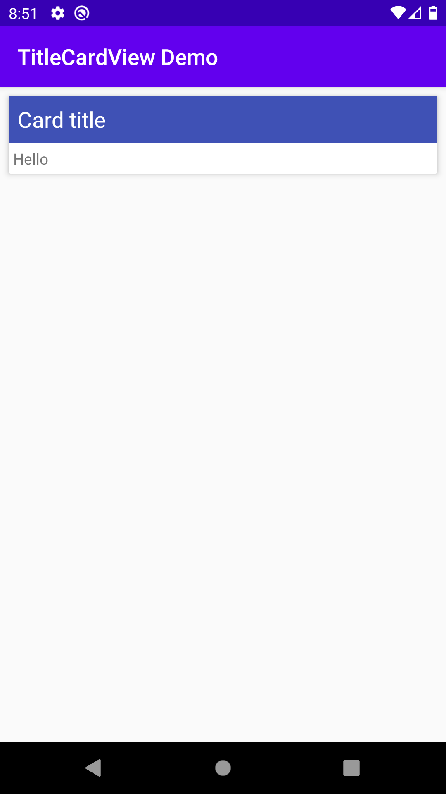
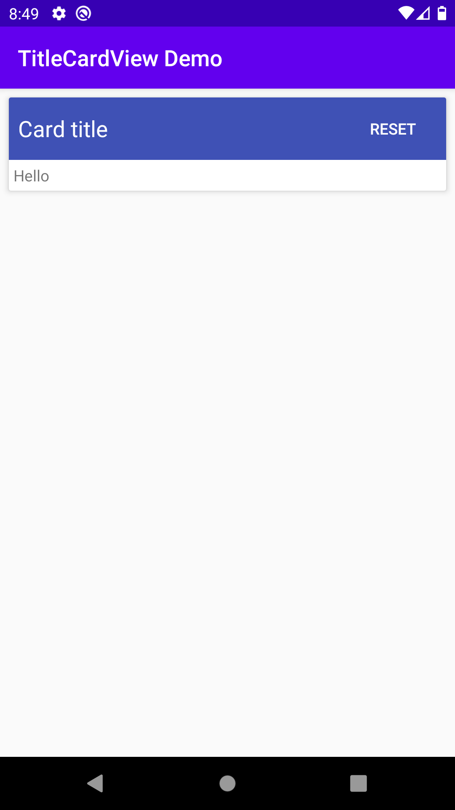

# CardView with title bar

&nbsp;


## Add the dependency
```
implementation 'dev.ov3rk1ll.widget:title-card-view:1.0.0'
```

## Usage
Place the view in your layout
```xml
<dev.ov3rk1ll.widget.TitleCardView
        android:layout_width="match_parent"
        android:layout_height="wrap_content"
        app:cardElevation="4dp"
        app:cardTitle="Card title">

        <!-- Place any views in here -->
        
    </dev.ov3rk1ll.widget.TitleCardView>
```

To add a button to the title bar, set ```app:cardActionText="Button"```
and set a ```setOnActionClickListener(OnClickListener l)``` on the TitleCardView.